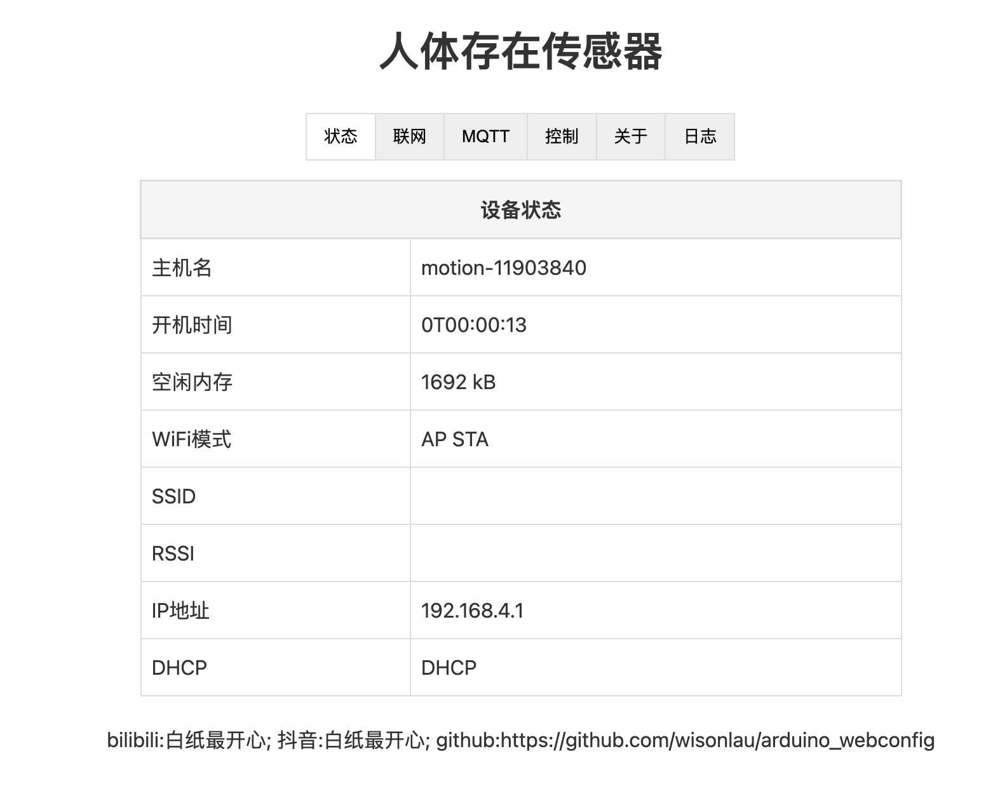

# Arduino配网页面(Arduino setting network page)

> #### 大部分功能都未完成,也不打算完成(Most functions have not been completed and are not intended to be completed)
>
> web.html 里面有部分页面未移植到代码里(There are some pages in web.html that are not ported to the code)